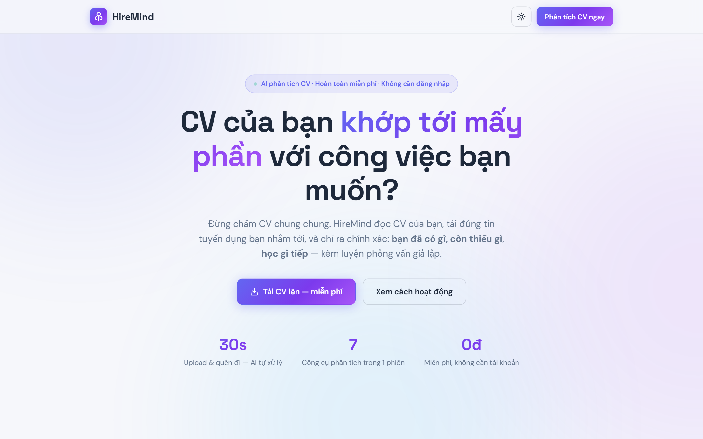

# HireMind 🧠

> **AI đối chiếu CV với tin tuyển dụng thật** — không chấm chung chung.

Ứng viên tải CV lên + dán link tin tuyển dụng → HireMind đọc cả hai và chỉ ra chính xác: **bạn đã có gì, còn thiếu gì, học gì tiếp** — kèm chat coach, phỏng vấn giả lập, cover letter.



## Tính năng

| | |
|---|---|
| 📄 **Đọc mọi định dạng CV** | PDF, DOCX, TXT, MD, ảnh (JPG/PNG/WEBP) — kể cả CV chụp điện thoại / PDF scan (AI vision OCR) |
| 🔗 **Tự tải JD từ link** | TopCV, ITviec, VietnamWorks... qua 3 tầng fallback (direct → proxy → headless Chromium qua Cloudflare) |
| 🎯 **Đối chiếu CV ↔ JD** | Điểm khớp ATS, từng yêu cầu: đáp ứng/thiếu + bằng chứng trích từ CV, severity từng gap |
| 📊 **Chấm điểm CV** | 4 tiêu chí (nội dung, trình bày, liên quan, tác động) + điểm mạnh/điểm yếu có dẫn chứng |
| 🚩 **ATS Red Flags** | Những gì khiến CV bị hệ thống lọc loại |
| 🗺️ **Skill Roadmap** | Lộ trình lấp khoảng trống kỹ năng — từng bước có thời gian + cách học |
| 💬 **Chat Coach** | Hỏi bất cứ điều gì về CV & JD của chính bạn |
| 🎤 **Mock Interview** | AI đóng vai interviewer hỏi theo CV của bạn, chấm từng câu, báo cáo tổng kết |
| ✉️ **Cover Letter** | Tự viết từ CV thật + JD, chọn giọng văn, xuất PDF |
| 🔗 **Link phiên riêng** | Không cần đăng nhập — upload xong có thể thoát trang, server tự xử lý tiếp; mở link để xem bất cứ lúc nào |
| ☀️🌙 **Light/Dark mode** | Nền sáng dịu mặc định, dark mode sâu, nhớ lựa chọn |

## Chạy dự án

```bash
npm install
cp .env.example .env    # rồi điền AI_BASE_URL / AI_API_KEY của bạn
npm start
# → http://localhost:3000
```

Cấu hình AI (OpenAI-compatible) — đọc từ `.env` (không bao giờ commit key vào source):

```bash
AI_BASE_URL=...        # endpoint OpenAI-compatible của bạn
AI_API_KEY=...         # key — giữ bí mật, chỉ nằm trong .env
AI_MODEL=main_model
PORT=3000
```

> **Bảo mật khi deploy:** `.env` và `data/` (CV người dùng) đã nằm trong `.gitignore` — không commit. Server tự load `.env` khi khởi động; có rate limit, CSP headers, chặn path traversal & SSRF sẵn.

## Deploy lên host (subdomain, vd: hackathon.tên-miến.vn)

1. Up source **không kèm** `.env` và `data/` (git đã lo, hoặc loại trừ tay khi nén)
2. Trên host: `npm install` → tạo `.env` điền key AI thật → `npm start` (khuyến nghị `pm2 start server.js --name hiremind`)
3. Reverse proxy (Nginx/Caddy) trỏ subdomain về `PORT` — bật HTTPS cho subdomain (Let's Encrypt)
4. AI endpoint: nếu AI provider chạy local trên máy khác, đảm bảo host deploy gọi được `AI_BASE_URL`; đổi URL trong `.env` của host accordingly

## Cấu trúc thư mục

```
├── server.js            # Express: routes + upload
├── lib/
│   ├── ai.js            # AI client + JSON extraction + vision OCR
│   ├── jd.js            # Fetch JD: direct → jina.ai → Chromium
│   ├── pipeline.js      # Pipeline nền: extract → validate → JD → analyze
│   └── services.js      # Chat / Interview / Cover Letter
├── public/              # SPA không build step
│   ├── index.html       # Landing + wizard 3 bước
│   ├── session.html     # Dashboard kết quả (7 tabs)
│   ├── css/  js/        # Design tokens light/dark + logic
├── data/<sessionId>/    # session.json + uploads/ (mỗi phiên 1 thư mục)
├── docs/                # Tài liệu dự án + slide proposal
│   ├── ARCHITECTURE.md  # Kiến trúc kỹ thuật
│   ├── DECISIONS.md     # Quyết định thiết kế & lý do
│   ├── PROGRESS.md      # Log tiến độ / memory
│   └── slides/          # Slide proposal PDF
└── scripts/             # Screenshot/test helpers (Playwright)
```

## Tài liệu

- **[docs/ARCHITECTURE.md](docs/ARCHITECTURE.md)** — kiến trúc, luồng dữ liệu, sơ đồ
- **[docs/DECISIONS.md](docs/DECISIONS.md)** — tại sao chọn từng thứ (stack, 1 session = 1 CV, JD 3 tầng...)
- **[docs/PROGRESS.md](docs/PROGRESS.md)** — nhật ký phát triển

## Demo flow (60 giây)

1. Mở `http://localhost:3000` → kéo CV (ảnh chụp cũng được) vào
2. Dán link tin tuyển dụng TopCV → **Phân tích ngay**
3. Copy link phiên (có thể thoát trang — server tự xử lý)
4. ~1–3 phút sau mở link: điểm CV, điểm khớp ATS, skill gap, lộ trình
5. Chat với Coach / bấm **Phỏng vấn giả lập** / tạo **Cover Letter**

---

*Hackathon 2026 — Track: AI application. Built with Node.js + Express + Vanilla JS + OpenAI-compatible AI.*
